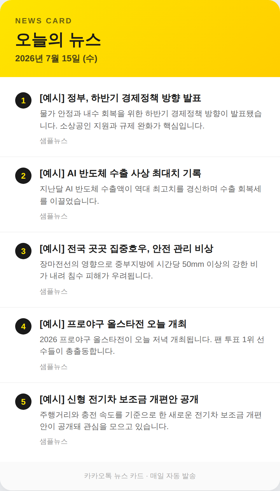

### hunter

# 📰 뉴스 카드 & 카카오톡 자동 송출

매일 뉴스를 모아 예쁜 **뉴스 카드**를 만들고, **카카오톡으로 자동 전송**하는 프로그램입니다.

<p align="center">
  
</p>

---

## ✨ 기능

- 뉴스 데이터를 모아 카카오톡 노란색 테마의 **HTML 뉴스 카드** 생성
- (선택) HTML 카드를 **PNG 이미지**로 렌더링
- **카카오톡 '나에게 보내기'** API 로 뉴스 자동 전송 (텍스트 / 피드 카드)
- 액세스 토큰 만료 시 **리프레시 토큰으로 자동 재발급**
- **GitHub Actions** 로 매일 정해진 시간에 자동 송출

---

## 🚀 빠른 시작

```bash
# 1) 패키지 설치
pip install -r requirements.txt

# 2) 설정 파일 준비
cp .env.example .env      # 그리고 .env 안의 값을 채우세요

# 3) 카드만 미리 만들어 보기 (전송 X)
python main.py --date 2026-07-15 --no-send --png

# 4) 카카오로 보낼 내용만 확인 (실제 전송 X)
python main.py --dry-run

# 5) 실제 전송
python main.py
```

생성된 카드는 `output/` 폴더에 저장됩니다.

---

## 🔑 카카오 토큰 준비 (한 번만)

1. [카카오 개발자 콘솔](https://developers.kakao.com) 에서 애플리케이션 생성
2. **앱 키 > REST API 키** 를 `.env` 의 `KAKAO_REST_API_KEY` 에 입력
3. **카카오 로그인** 활성화 후, **동의항목**에서 `카카오톡 메시지 전송(talk_message)` 권한 추가
4. OAuth 인증으로 **액세스 토큰 / 리프레시 토큰** 발급
   - 액세스 토큰 → `.env` 의 `KAKAO_ACCESS_TOKEN`
   - 리프레시 토큰 → `.env` 의 `KAKAO_REFRESH_TOKEN` (설정 시 만료돼도 자동 갱신)

> 리프레시 토큰까지 설정하면, 액세스 토큰이 만료돼도 프로그램이 알아서 새로 발급받아 계속 전송합니다. → 진짜 "자동 송출"

---

## 📰 뉴스 데이터 넣는 법

두 가지 방법 중 하나를 선택하세요.

**방법 A. 로컬 파일 (기본)**
`data/news_2026-07-15.json` 처럼 날짜별 파일을 만들면 됩니다.

```json
{
  "date": "2026-07-15",
  "items": [
    { "title": "제목", "summary": "요약", "source": "출처", "url": "https://..." }
  ]
}
```

**방법 B. RSS 실시간 수집**
`.env` 의 `NEWS_RSS_URL` 에 뉴스 RSS 주소를 넣으면 실행할 때마다 최신 뉴스를 가져옵니다.

---

## ⏰ 매일 자동 송출 (GitHub Actions)

`.github/workflows/daily-news.yml` 이 매일 자동으로 실행됩니다.

1. 저장소 **Settings > Secrets and variables > Actions** 에서 아래 시크릿 등록
   - `KAKAO_REST_API_KEY`, `KAKAO_ACCESS_TOKEN`, `KAKAO_REFRESH_TOKEN`, (선택) `NEWS_RSS_URL`
2. 실행 시각은 워크플로의 `cron` 값으로 조절 (기본: 매일 한국시간 오전 7시)

> 내 PC 에서 자동 실행하고 싶다면 `crontab` 도 사용할 수 있습니다:
> ```
> 0 7 * * *  cd /path/to/hunter && /usr/bin/python3 main.py
> ```

---

## 🧩 명령어 옵션

| 옵션 | 설명 |
|------|------|
| `--date YYYY-MM-DD` | 대상 날짜 (기본: 오늘) |
| `--title "..."` | 카드 제목 |
| `--limit N` | 뉴스 개수 |
| `--template text\|feed` | 카카오 템플릿 종류 (기본: text) |
| `--png` | HTML 을 PNG 로도 렌더링 (playwright 필요) |
| `--no-send` | 전송 없이 카드만 생성 |
| `--dry-run` | 보낼 내용만 출력 (전송 X) |

---

## 📂 프로젝트 구조

```
hunter/
├── main.py                     # 실행 진입점(CLI)
├── news_card/
│   ├── config.py               # .env / 환경변수 로더
│   ├── news.py                 # 뉴스 수집(로컬 JSON / RSS)
│   ├── card.py                 # HTML 카드 + 카카오 템플릿 생성
│   └── kakao.py                # 카카오 전송 & 토큰 갱신
├── data/news_2026-07-15.json   # 뉴스 샘플 데이터
├── .github/workflows/daily-news.yml   # 매일 자동 송출
├── .env.example                # 설정 예시
└── requirements.txt
```
